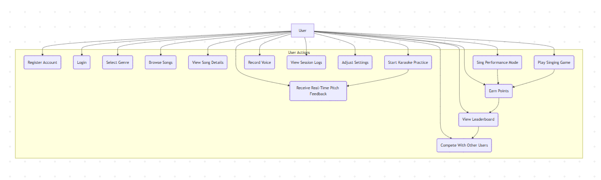
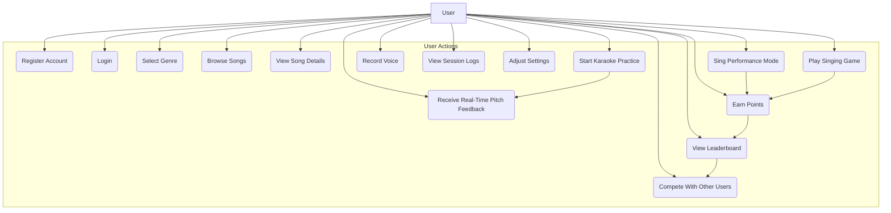
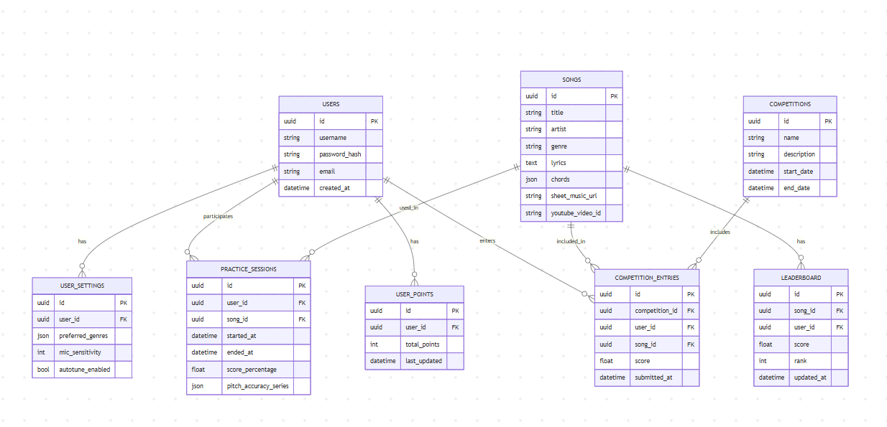
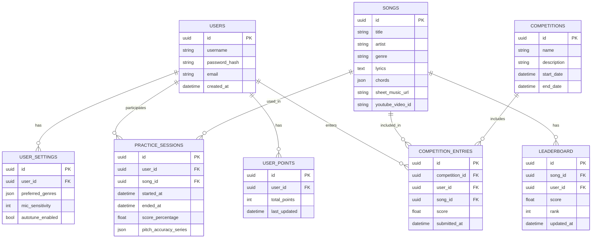
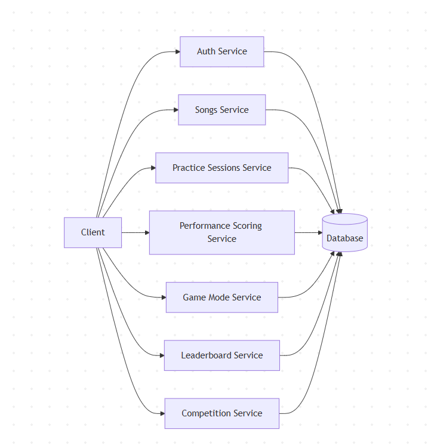
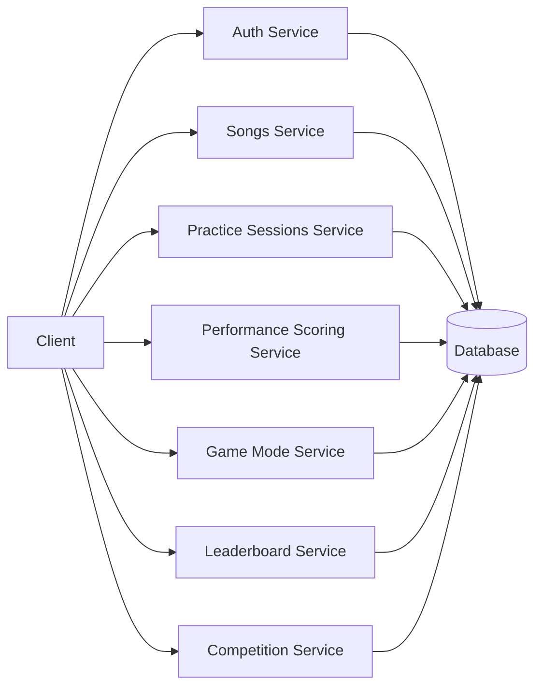
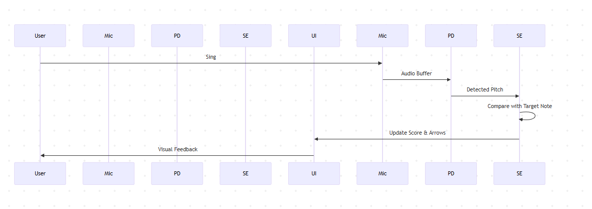
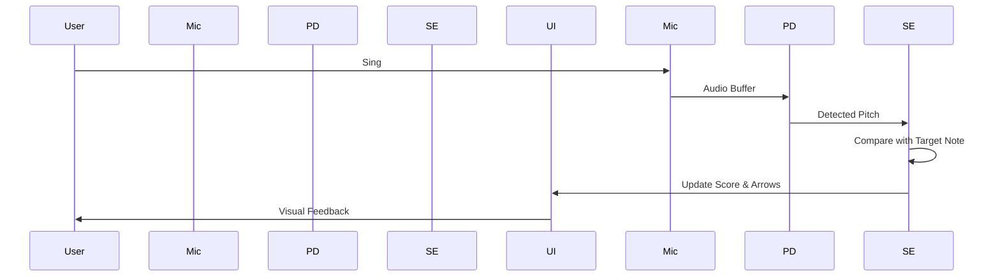
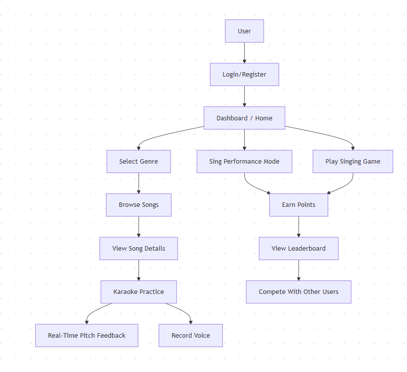
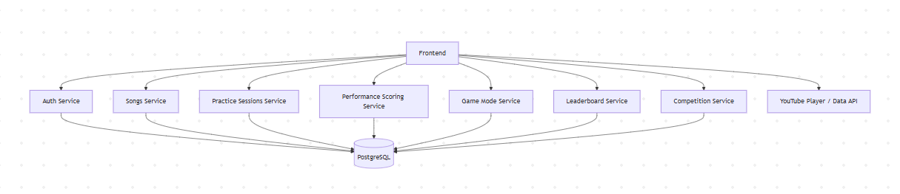

# Singing Coach App – Full Technical Documentation

This Markdown document contains the full technical specification of the Singing Coach App with **Mermaid-compatible diagrams**.

---

## Table of Contents

1. SRS (Functional & Non-Functional Requirements)
2. Use Case Diagrams
3. ERD / Database Schema
4. API Flow Diagrams
5. Sequence Diagrams
6. Module / Package Hierarchy
7. Milestones

---

## 1. SRS

### Functional Requirements

* User registration/login
* Browse songs by genre
* View lyrics, chords, sheet music
* Select karaoke/backing tracks (YouTube)
* Real-time pitch detection with visual feedback
* Record practice sessions
* Track progress and evolution
* Game mode with points and leaderboard
* Competition mode

### Non-Functional Requirements

* Web-first PWA (mobile-friendly)
* Responsive design
* Secure authentication (JWT)
* Local caching and offline mode
* Smooth WebGL graphics
* High performance real-time pitch detection

---

## 2. Use Case Diagram (Mermaid Flowchart Compatible)



---

## 3. ERD / Database Schema



---

## 4. API Flow Diagram



---

## 5. Sequence Diagram Example (Performance Mode)



---

## 6. Module / Package Hierarchy

```mermaid
flowchart TB
    subgraph Frontend[Frontend (React + WebAudio + Three.js)]
        LoginPage(Login/Register Page)
        Dashboard(Dashboard / Home)
        SongBrowser(Song Browser & Detail)
        Karaoke(Karaoke Practice Page)
        Recording(Recording Page)
        Performance(Performance Mode Page)
        Game(Game Mode Page)
        LeaderboardPage(Leaderboard Page)
        CompetitionPage(Competition Page)
    end

    subgraph Backend[Backend API (Node.js / NestJS)]
        Auth(Auth Service)
        UserSettings(User Settings Service)
        SongsService(Songs Service)
        PracticeService(Practice Sessions Service)
        PerformanceService(Performance Scoring Service)
        GameService(Game Mode Service)
        LeaderboardService(Leaderboard Service)
        CompetitionService(Competition Service)
    end

    User --> LoginPage
    User --> Dashboard
    User --> SongBrowser
    User --> Karaoke
    User --> Recording
    User --> Performance
    User --> Game
    User --> LeaderboardPage
    User --> CompetitionPage

    LoginPage --> Auth
    Dashboard --> UserSettings
    SongBrowser --> SongsService
    Karaoke --> PracticeService
    Performance --> PerformanceService
    Game --> GameService
    LeaderboardPage --> LeaderboardService
    CompetitionPage --> CompetitionService
```

---

## 7. Milestones

* Milestone 0: Project Kickoff & Planning
* Milestone 1: Basic Auth & User Profiles
* Milestone 2: Song Catalogue & YouTube Integration
* Milestone 3: Real-Time Pitch Detection Prototype
* Milestone 4: Practice Mode (Karaoke + Feedback)
* Milestone 5: Performance Mode & Scoring
* Milestone 6: Game Mode & Points System
* Milestone 7: Leaderboard & Competitions
* Milestone 8: Analytics & Reporting
* Milestone 9: Security, QA & PWA Packaging
* Milestone 10: Launch Readiness
8. Flowcharts & Technical Overview
User Interaction Flow

flowchart TD
    User --> Login[Login/Register]
    Login --> Dashboard[Dashboard / Home]
    Dashboard --> Genre[Select Genre]
    Genre --> Songs[Browse Songs]
    Songs --> SongDetails[View Song Details]
    SongDetails --> Practice[Karaoke Practice]
    Practice --> PitchFeedback[Real-Time Pitch Feedback]
    Practice --> Recording[Record Voice]
    Dashboard --> PerformanceMode[Sing Performance Mode]
    PerformanceMode --> Points[Earn Points]
    Dashboard --> GameMode[Play Singing Game]
    GameMode --> Points
    Points --> Leaderboard[View Leaderboard]
    Leaderboard --> Competition[Compete With Other Users]
Technical Overview Flow

flowchart TD
    Frontend --> AuthService[Auth Service]
    Frontend --> SongService[Songs Service]
    Frontend --> PracticeService[Practice Sessions Service]
    Frontend --> PerformanceService[Performance Scoring Service]
    Frontend --> GameService[Game Mode Service]
    Frontend --> LeaderboardService[Leaderboard Service]
    Frontend --> CompetitionService[Competition Service]


    AuthService --> DB[(PostgreSQL)]
    SongService --> DB
    PracticeService --> DB
    PerformanceService --> DB
    GameService --> DB
    LeaderboardService --> DB
    CompetitionService --> DB


    Frontend --> External[YouTube Player / Data API]

This final section provides flowcharts for every use case and a high-level technical overview in words and diagrams.


9. Project Scaffold & Build Instructions
Frontend

React + Vite + TypeScript + WebAudio + Three.js

Pages: Login/Register, Dashboard, Song Browser/Detail, Karaoke Practice, Performance Mode, Game Mode, Leaderboard, Competition

Components: PitchDetector, Visualizer, Recording, LeaderboardTable, CompetitionList

Services: API client, localStorage sync, YouTube embed handler

Scripts: npm run dev

Backend

Node.js + NestJS + PostgreSQL

Modules: Auth, Users, Songs, PracticeSessions, Performance, Game, Leaderboard, Competition

Database tables: as per ERD

JWT authentication with access/refresh tokens

Scripts: npm run start:dev

DB migrations: Prisma migrations for PostgreSQL

Docker

docker-compose.yml with frontend, backend, db (PostgreSQL)


Folder Structure

SingingCoachApp/

│

├── frontend/

│ ├── package.json

│ ├── tsconfig.json

│ ├── vite.config.ts

│ ├── src/

│ │ ├── main.tsx

│ │ ├── App.tsx

│ │ ├── components/

│ │ │ ├── PitchDetector.tsx

│ │ │ ├── Visualizer.tsx

│ │ │ ├── Recording.tsx

│ │ │ ├── LeaderboardTable.tsx

│ │ │ └── CompetitionList.tsx

│ │ └── pages/

│ │ ├── Login.tsx

│ │ ├── Register.tsx

│ │ ├── Dashboard.tsx

│ │ ├── SongBrowser.tsx

│ │ ├── KaraokePractice.tsx

│ │ ├── PerformanceMode.tsx

│ │ ├── GameMode.tsx

│ │ ├── Leaderboard.tsx

│ │ └── Competition.tsx

│

├── backend/

│ ├── package.json

│ ├── tsconfig.json

│ ├── nest-cli.json

│ ├── src/

│ │ ├── main.ts

│ │ ├── app.module.ts

│ │ ├── modules/

│ │ │ ├── auth/

│ │ │ ├── users/

│ │ │ ├── songs/

│ │ │ ├── practice-sessions/

│ │ │ ├── performance/

│ │ │ ├── game/

│ │ │ ├── leaderboard/

│ │ │ └── competition/

│ │ └── prisma/

│ │ ├── schema.prisma

│ │ └── migrations/

│

├── docker-compose.yml

└── README.md

